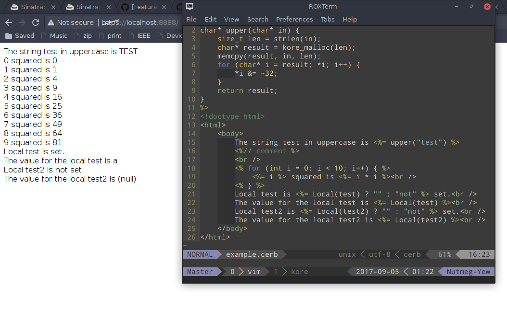

## erb but for c

For use with [kore](https://kore.io)

Make a views directory outside your source directory, and put `example.cerb` in it. Then run cerb, and use it like this

```c
	#include <views.h>
	// ...
	char* result = Cerb(example, (cerb_local) {"test", "a"});
	http_response(req, 200, result, strlen(result));
	// do NOT free result here
	return KORE_RESULT_OK;
```

It should look something like this



Instead of writing out the cast for each local variable, you can obtain a `cerb_local` object with the macro `Local(test, "a")` for the same effect

There's currently no way to specify that you don't want any local variables

You'll have to rerun cerb every time you change your view
