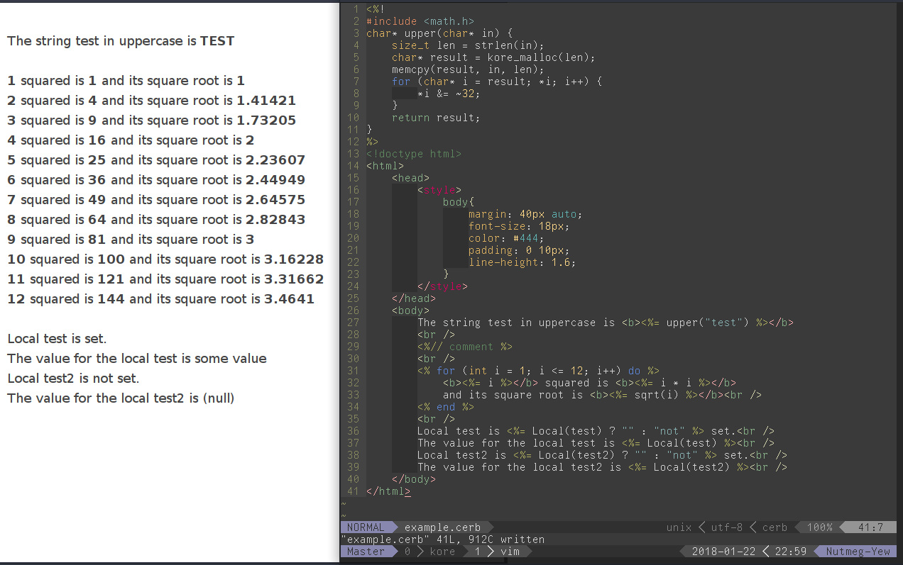

## erb but for c

For use with [kore](https://kore.io)

Make a views directory outside your source directory, and put `example.cerb` in it. Then run cerb, and use it like this

```c
	#include <views.h>
	// ...
	char* result = Cerb(example, Local(test, "some value"));
	http_response(req, 200, result, strlen(result));
	// do NOT free result here
	return KORE_RESULT_OK;
```

It should look something like this



You can use an inline struct (`(cerb_local) {"test", "value"}`) instead of the `Local` macro for the same effect, or for dynamically generated local names.

You'll have to rerun cerb every time you change your view
